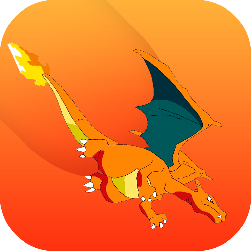

# EZSwiftExtensions

[](https://github.com/Carthage/Carthage)
[](https://img.shields.io/cocoapods/v/EZSwiftExtensions.svg)  
[](https://cocoapods.org/pods/EZSwiftExtensions)
[](http://cocoapods.org/pods/EZSwiftExtensions)
[](http://swift.org)
[](https://travis-ci.org/goktugyil/EZSwiftExtensions)



How Swift standard types and classes were supposed to work. A collection of useful extensions for the Swift Standard Library, Foundation, and UIKit.

- [Gitter chat room](https://gitter.im/EZSwiftExtensions/Lobby)

## Contents

- [EZ functions and variables](#ez-functions-and-variables)
- [NSObject](#nsobject-extensions)
- [Bool](#bool-extensions)
- [Int](#int-extensions)
- [Double](#double-extensions)
- [String](#string-extensions)
- [NSAttributedString](#nsattributedstring-extensions)
- [Array](#array-extensions)
- [Dictionary](#dictionary-extensions)
- [NSDate](#nsdate-extensions)
- [NSTimer](#nstimer-extensions)
- [CGRect](#cgrect-extensions)
- [UIViewController](#uiviewcontroller-extensions)
- [UIStoryBoard](#uistoryboard-extensions)
- [UIView](#uiview-extensions)
- [UITextView](#uitextview-extensions)
- [UILabel](#uilabel-extensions)
- [UIImageView](#uiimageview-extensions)
- [UIImage](#uiimage-extensions)
- [Block Objects](#block-objects)
- [UIDevice](#uidevice-extensions)
- [NSUserDefaults](#nsuserdefaults-extensions)
- [NSURL](#nsurl-extensions)

### EZ functions and variables:

Easily access your projects version and build numbers:

``` swift
print(ez.appVersion) // 0.3
print(ez.appBuild) // 7
print(ez.appVersionAndBuild) // v0.3(7)
```

Easily access your ViewController on top of your view stack:

``` swift
ez.topMostViewController?.presentViewController(myAlertController, animated: true, completion: nil)
// topMostViewController is your rootViewController
// Intended for showing small VCs like UIAlertController
```

Easily access your screen orientation:

``` swift
if UIInterfaceOrientationIsPortrait(ez.screenOrientation) {
  // Screen orientation is portrait
} else {
  // Screen orientation is not portrait
}
```

Easily access your screen traitCollections:

``` swift
print(ez.verticalSizeClass) // regular on iPhone6
print(ez.horizontalSizeClass) // compact  on iPhone6
```

Easily access your screen traitCollections:

``` swift
print(ez.screenWidth) // 375.0 on iPhone6
print(ez.screenHeight) // 667.0 on iPhone6
```

Easily access your status bar height:

``` swift
print(ez.screenStatusBarHeight) // 20.0 on iPhone6
print(ez.screenHeightWithoutStatusBar) // 647.0 on iPhone6
```

Easily track screen shots:

``` swift
ez.detectScreenShot { () -> () in
    print("User took a screen shot")
}
```
Easily request images:

``` swift
ez.requestImage("http://www.asdf.com/89asdf.gif") { (image) -> Void in
    let myImage = image
}
```
Easily request JSON:

``` swift
ez.requestJSON("http://ajax.googleapis.com/ajax/services/search/web?v=1.0&q=facebook", success: { (object) -> Void in
    print(object) // prints whole bunch of shit
    }) { (error) -> Void in
        print(error)
}
```

Easily run code in main thread:

``` swift
ez.runThisInMainThread { () -> Void in
    print("Tired of ugly code like: dispatch_async(dispatch_get_main_queue(), block: dispatch_block_t)!!!")
}
```
Easily run code in background:

``` swift
ez.runThisInBackground { () -> () in
    print("Runs this in default priority queue")
}
```

### NSObject Extensions

Easily get the name of your class:

``` swift
let vc = UIViewController()
print(vc.className) // UIViewController

print(UIViewController.className) // UIViewController
```

### Bool Extensions

Easily toggle it:

``` swift
var myBool: Bool = true
print(myBool.toggle()) // false
```

### Int Extensions

Easy instance variables:

``` swift
var myNumber = -33
print(myNumber.isEven) // false
print(myNumber.isOdd) // true
print(myNumber.isPositive) // false
print(myNumber.isNegative) // true
print(myNumber.digits) // 2
```

Easily get a range from an integer:

``` swift
for index in 5.range {
    print(index) // 0 1 2 3 4
}
// Seriously the most intuitive way to write for loops in Swift
```

Easily convert between different types:

``` swift
var someUInt: UInt = 3
var myInt = someUInt.toInt

var myDouble = myInt.toDouble
var myFloat = myInt.toFloat
var myCGFloat = myInt.toCGFloat
var myString = myInt.toString
var myUInt = myInt.toUInt
```

##Double Extensions

Easily convert between different types:

``` swift
var myString = "33.3"
var myDouble = myString.toDouble
var myInt = myDouble.toInt
```

### String Extensions

Easily access with subscripts:

``` swift
var myString = "eZSwiftExtensions"
print(myString[2]) // S
print(myString[3]) // w
print(myString[2...4]) // Swi
print(myString.getIndexOf("w") // 3
```

Easy instance variables:

``` swift
var myString = "eZSwiftExtensions is awesome!"
print(myString.length) // 29
print(myString.capitalizeFirst) // EZSwiftExtensions is awesome!
```

Easily check if it contains a string:

``` swift
var myString = "eZSwiftExtensions is awesome!"
print(myString.contains("squirtle")) // false
print(myString.contains("awesome")) // true
print(myString.contains("AWESOME")) // false
print(myString.contains("AWESOME", compareOption: NSStringCompareOptions.CaseInsensitiveSearch)) // true
```
Easily check if string is empty and trim it:

``` swift
var myString = "\n    eZSwiftExtensions is awesome!     \n \n "
let emptyStr = "   \n \n \n"

print(myString.isOnlyEmptySpacesAndNewLineCharacters()) // false //v. 1.5 and earlier
print(emptyStr.isOnlyEmptySpacesAndNewLineCharacters()) // true //v. 1.5 and earlier
print(myString.isBlank) // false
print(emptyStr.isBlank) // true

myString.trim()
print(myString) // eZSwiftExtensions is awesome!
```

Easily check if string contains emails or urls:

``` swift
var myString = "eZSwiftExtensions is awesome!"
let emailStr = "charmander@gmail.com"
print(myString.isEmail) // false
print(emailStr.isEmail) // true

let urlString = "http://www.google.com is great but www.facebook.com not that much"
print(myString.extractURLs) // []
print(emailStr.extractURLs) // [mailto:charmander@gmail.com]
print(urlString.extractURLs) // [http://www.google.com, https://www.facebook.com/]
```
Easily convert to numbers:

``` swift
let myNumberString = "13"
myNumberString.toInt()
myNumberString.toDouble()
myNumberString.toFloat()
```

Easily get the bool value of a String:

``` swift
let myString = "false"
let myOtherString = "hello"
print(myString.toBool()) // false
print(myOtherString.toBool()) // nil
```

Easily check if string is a number:

``` swift
let myStr = "10.5"
let myOtherStr = "Legolas"
print(myStr.isNumber()) // true
print(myOtherStr.isNumber()) // false
```

Easily count the number of instances of a text inside String:

``` swift
let str = "yes yes yes yesyesyes"
print(str.count("yes")) // 6
```

### NSAttributedString Extensions

Easily change the typeface:

``` swift
var str = NSAttributedString(string: "Hello")
let attrStr1 = str.underline()
let attrStr2 = str.bold()
let attrStr3 = str.italic()
```

Easily change the color:

``` swift
var str = NSAttributedString(string: "Hello")
str.color(UIColor.blueColor())
```

Easily use multiple options:

``` swift
var str = NSAttributedString(string: "Hello")
str.bold().underline().color(UIColor.blueColor())
```

Easily add NSAttributedStrings:

``` swift
var str = NSAttributedString(string: "Hello")
var str2 = NSAttributedString(string: " World")
str += str2 //Hello World
```

### Array Extensions

Easily access a random element:

``` swift
var myArray = ["charmander","bulbasaur","squirtle"]
print(myArray.random()) // bulbasaur or something else
```
Easily find the indexes of an object:

``` swift
var myArray = ["charmander","bulbasaur","squirtle","charmander"]
print(myArray.indexesOf("charmander")) // [0,3]
```

Easily get index of last occurrence of an object:

``` swift
var myArray = ["charmander","bulbasaur","squirtle","charmander"]
print(myArray.lastIndexOf("charmander")) // 3
```

Easily remove an object:

``` swift
var myArray = ["charmander","bulbasaur","squirtle"]
myArray.removeObject("charmander")
print(myArray) // ["bulbasaur", "squirtle"]
```

Easily check if an array contains instance of an object:

``` swift
var myArray = ["charmander","bulbasaur","squirtle"]
print(myArray.containsInstanceOf("charmander")) // true
print(myArray.containsInstanceOf(1)) // false
```

Easily check if an array contains another array:

``` swift
var myArray = ["charmander","bulbasaur","squirtle"]
print(myArray.containsArray(["charmander","bulbasaur"])) // true
print(myArray.containsArray(["string"])) // false
```

Easily shuffle an array:

``` swift
var myArray = ["charmander","bulbasaur","squirtle",1,2,3]
myArray.shuffle()
print(myArray) // [1,"squirtle","charmander",3,"bulbasaur",2]
```

Easily get an object at a specified index:

``` swift
var myArray = ["charmander","bulbasaur","squirtle"]
print(myArray.get(1)) // "bulbasaur"
```

Easily prepend an object to an array:

``` swift
var myArray = ["charmander","bulbasaur","squirtle"]
myArray.insertAsFirst("snorlax")
print(myArray) // ["snorlax","charmander","bulbasaur","squirtle"]
```

Easily determine if an array contains an object:

``` swift
var myArray = ["charmander","bulbasaur","squirtle"]
print(myArray.containsInstanceOf("squirtle")) // true
print(myArray.containsInstanceOf(11)) // false
```

Easily get intersection and union of two arrays:

``` swift
var myArray = ["charmander","bulbasaur","squirtle"]

print(myArray.intersection(["charmander","pikachu","bulbasaur"])) // ["charmander","bulbasaur"]

print(myArray.union(["charmander","pikachu"])) // ["charmander","bulbasaur","squirtle","pikachu"]
```

Easily get difference between two arrays (the elements in the an array which are not present in another input array):

``` swift
var myArray = ["charmander","bulbasaur","squirtle","pikachu"]
print(myArray.difference(["charmander","bulbasaur"])) // ["squirtle","pikachu"]
```

Easily test all elements of an array against a closure:

``` swift
let myArray = ["charmander","bulbasaur","squirtle"]
let result = myArray.testAll {
    if $0 == "charmander" { return true }
    else { return false }
}
print(result) // false
```

### Dictionary Extensions

Easily check if a key exists in the dictionary:

``` swift
var myDict = ["charmander": "fire","bulbasaur": "grass","squirtle": "water"]
print(myDict.has("charmander")) // True
print(myDict.has("pikachu")) // False
```

Easily access a random element:
``` swift
var myDict = ["charmander": "fire","bulbasaur": "grass","squirtle": "water"]
print(myDict.random()) // grass or something else
```

Easily add dictionaries to create new ones:

``` swift
var dictionary1 = ["charmander" : "fire"]
var dictionary2 = ["squirtle" : "water"]

dictionary1 += dictionary2
print(dictionary1) // ["charmander" : "fire", "squirtle" : "water"]
```
Easily get intersection or union of two dictionaries:

``` swift
var dictionary1 = ["charmander" : "fire", "bulbasaur" : "grass"]
var dictionary2 = ["charmander": "fire","squirtle": "water"]

var dictionary3 = dictionary1.intersection(dictionary2)
print(dictionary3)// ["charmander" : "fire"]

dictionary3 = dictionary1.union(dictionary2)
print(dictionary3) // ["charmander": "fire","bulbasaur": "grass","squirtle": "water"]
```
Easily get difference of two dictionaries (key value pairs that are only present in one dictionary):

``` swift
var dictionary1 = ["charmander" : "fire", "bulbasaur" : "grass"]
var dictionary2 = ["charmander": "fire","squirtle": "water"]
difference(dictionary1, dictionary2) // ["bulbasaur" : "grass", "squirtle": "water"]
```

### NSDate Extensions

Easily initialize your string:

``` swift
let format = "yyyy/MM/dd"
let fromString = "2016/01/11"
print(NSDate(fromString: fromString, format: format)) // Optional("2016/01/11 00:00:00 +0000")
```
Easily convert date into string:

``` swift
let now = NSDate()
print(now.toString())
print(now.toString(dateStyle: .MediumStyle, timeStyle: .MediumStyle))
print(now.toString(format: "yyyy/MM/dd HH:mm:ss"))
```
Easily see how much time passed:

``` swift
let now = NSDate()
let later = NSDate(timeIntervalSinceNow: -100000)
print(later.daysInBetweenDate(now)) // 1.15740740782409
print(later.hoursInBetweenDate(now)) // 27.7777777733571
print(later.minutesInBetweenDate(now)) // 1666.66666641732
print(later.secondsInBetweenDate(now)) // 99999.999984026
```
Easily humanize how much time passed:

``` swift
let date1 = NSDate(timeIntervalSinceNow: -100000)
print(date1.timePassed()) // 1 day ago
let date2 = NSDate(timeIntervalSinceNow: -10000)
print(date2.timePassed()) // 2 hours ago
let date3 = NSDate(timeIntervalSinceNow: -1000)
print(date3.timePassed()) //16 minutes ago
```
Easily check if dates are equal:

``` swift
let now = NSDate()
let now2 = NSDate()
print(now == now2) // false, cause microseconds passed between declarations
```
Easily check which date is larger:

``` swift
let now = NSDate()
let now2 = NSDate()
print(now < now2) // true
print(now2 < now) // false  
```

### NSTimer Extensions

Easily run block of codes after a certain delay:

``` swift
NSTimer.runThisAfterDelay(seconds: 2) { () -> () in
    print("Prints this 2 seconds later in main queue")
}

```
Easily run code after delay in another thread:

``` swift
NSTimer.runThisAfterDelay(seconds: 2, queue: dispatch_get_global_queue(DISPATCH_QUEUE_PRIORITY_LOW, 0)) { () -> () in
    print("Prints this 2 seconds later in low priority queue")
}
```
Easily run code every seconds:

``` swift
var count = 0
NSTimer.runThisEvery(seconds: 1) { (timer) -> Void in
    print("Will print every second")
    if count == 3 {
        timer.invalidate()
    }
    count++
}
```

### CGRect Extensions

Easily initialize:

``` swift
let rect = CGRect(x: 100, y: 100, w: 100, h: 100)
```

### UIViewController Extensions

Easily access ViewController sizes:

``` swift
// Can be called in any method inside a UIViewController
override func viewDidAppear(animated: Bool) {
	super.viewDidAppear(animated)

	print(self.top) // 44.0 starting position of ViewController
	print(self.bottom) // 647.0 bottom position of ViewController
	print(self.applicationFrame) // (0.0, 44.0, 375.0, 603.0)
}
```
Easily access NavigationController and NavigationBar elements:

``` swift
override func viewDidAppear(animated: Bool) {
	super.viewDidAppear(animated)

    print(self.tabBarHeight) // Works in NavigationController otherwise its 0
    print(self.navigationBarHeight) // Works in NavigationController otherwise its 0
    print(self.navBar) // Returns NavigationBar, works in NavigationController otherwise its nil
}
```
Easily navigate between UIViewControllers:

``` swift
override func viewDidAppear(animated: Bool) {
	super.viewDidAppear(animated)

    let myViewController = myViewController()
    pushVC(myViewController) // Instead of navigationController?.pushViewController(myViewController, animated: true)

    popVC() // Instead of navigationController?.popViewControllerAnimated(true)

    presentVC(myViewController) // Instead of presentViewController(myViewController, animated: true, completion: nil)

    dismissVC(completion: nil) // Instead of dismissViewControllerAnimated(true, completion: completion)}
```
Easily hide the keyboard when user taps around the UIViewController:

```swift 
    override func viewDidLoad() {
        super.viewDidLoad()
        self.hideKeyboardWhenTappedAround()
    }
```
Easily add UIViewControllers:

``` swift
    let myViewController = myViewController()
    addAsChildViewController(myViewController, toView: self.anySubview) // Adding view controller as a child view controller to subview
```

### UIStoryboard Extensions

Easily get the main storyboard:

``` swift
    let storyboard = UIStoryboard.mainStoryboard
```

Easily get view controller from storyboard:

``` swift
    //ViewController must be set both as custom class and StoryboardID in identity inspector
    let vc = storyboard!.instantiateVC(ViewController) //vc is of type ViewController
```

### UIView Extensions

Easily initialize your objects:

``` swift
let myView = UIView(x: 0, y: 0, w: 100, h: 100)
print(myView.frame) // (0.0, 0.0, 100.0, 100.0)

let myView2 = UIView(superView: myView)
print(myView2.frame) // (0.0, 0.0, 100.0, 100.0)

let myView3 = UIView(superView: myView2, padding: 20)
print(myView3.frame) // (20.0, 20.0, 60.0, 60.0)
```
Easily resize your UIView to contain its subviews:

``` swift
let view1 = UIView(x: 0, y: 0, w: 100, h: 100)
print(view1.frame) // (0.0, 0.0, 100.0, 100.0)

let view2 = UIView(x: 0, y: 0, w: 200, h: 200)
print(view2.frame) // (0.0, 0.0, 200.0, 200.0)

view1.addSubview(view2)
view1.resizeToFitSubviews()
print(view1.frame) // (0.0, 0.0, 200.0, 200.0)
```
Easily resize your UIView according to its contents:   

``` swift
let label = UILabel(x: 0, y: 0, w: 20, h: 20)
print(label.frame) // (0.0, 0.0, 20.0, 20.0)
label.text = "I find your lack of faith disturbing."
print(label.frame) // (0.0, 0.0, 20.0, 20.0)
label.resizeToFitWidth() // There is also a resizeToFitHeight()
print(label.frame) // (0.0, 0.0, 253.5, 20.0)
```
Easily view or change values inside your view.frame.size:

``` swift
let view = UIView(x: 50, y: 60, w: 70, h: 80)
print(view.x) // 50.0
print(view.y) // 60.0
print(view.w) // 70.0
print(view.h) // 80.0
view.x = 115 // You can also change the values
print(view.x) // 115.0
```
Easily view your UIView's sides:

``` swift
let view = UIView(x: 10, y: 50, w: 100, h: 200)
print(view.top) // 50.0
print(view.bottom) // 250.0 (y + h)
print(view.left) // 10.0
print(view.right) // 110.0 (x + w)
print(view.origin) // (10.0, 50.0)
print(view.centerX) // 60.0
print(view.centerY) // 150.0
print(view.size) // (100.0, 200.0)
```
Easily place your UIViews according to your other UIViews:

``` swift
let view = UIView(x: 0, y: 0, w: 100, h: 100)
let view2 = UIView(x: view.rightOffset(20), y: view.bottomOffset(20), w: 100, h: 100)
print(view2.frame) // (120.0, 120.0, 100.0, 100.0)
// There is also 'leftOffset' and 'topOffset'
```
Easily reorder your multiple subviews:

``` swift
let mainview = UIView(x: 0, y: 0, w: 100, h: 100)
let aview = UIView(x: 0, y: 0, w: 10, h: 10)
let bview = UIView(x: 0, y: 0, w: 10, h: 10)
let cview = UIView(x: 0, y: 0, w: 10, h: 10)
mainview.addSubview(aview)
mainview.addSubview(bview)
mainview.addSubview(cview)

mainview.reorderSubViews(true)
print(aview.frame) // (0.0, 0.0, 10.0, 10.0)
print(bview.frame) // (0.0, 10.0, 10.0, 10.0)
print(cview.frame) // (0.0, 20.0, 10.0, 10.0)
// This only works in reordering vertically
```
Ignore specific subviews while reordering:

``` swift
let mainview = UIView(x: 0, y: 0, w: 100, h: 100)
let aview = UIView(x: 0, y: 0, w: 10, h: 10)
let bview = UIView(x: 0, y: 0, w: 10, h: 10)
let cview = UIView(x: 0, y: 0, w: 10, h: 10)
cview.tag = 155
mainview.addSubview(aview)
mainview.addSubview(bview)
mainview.addSubview(cview)

mainview.reorderSubViews(true, tagsToIgnore: [155])
print(aview.frame) // (0.0, 0.0, 10.0, 10.0)
print(bview.frame) // (0.0, 10.0, 10.0, 10.0)
print(cview.frame) // (0.0, 0.0, 10.0, 10.0)
```
Easily remove all subviews:

``` swift
let mainview = UIView(x: 0, y: 0, w: 100, h: 100)
let aview = UIView(x: 0, y: 0, w: 10, h: 10)
let bview = UIView(x: 0, y: 0, w: 10, h: 10)
let cview = UIView(x: 0, y: 0, w: 10, h: 10)
mainview.addSubview(aview)
mainview.addSubview(bview)
mainview.addSubview(cview)
print(mainview.subviews) // 3 subviews
mainview.removeSubviews()
print(mainview.subviews) // []
```
Easily center view in superview:

``` swift
myView.centerXInSuperView() //centers horizontally
myView.centerYInSuperView() //centers vertically
myView.centerInSuperView() //centers horizontally & vertically
```
Easily rotate views on their axis:

``` swift
let mainview = UIView(x: 0, y: 0, w: 100, h: 100)
mainview.setRotationX(20)
print(mainview.frame) // (-0.869926985934792, 3.80534410225589, 101.73985397187, 93.996750906345)

mainview.setRotationY(20)
print(mainview.frame) // (2.19790499139913, -0.869926985934787, 93.996750906345, 101.73985397187)

mainview.setRotationZ(20)
print(mainview.frame) // (-14.0856382055789, -14.0856382055789, 128.171276411158, 128.171276411158)
```
Easily scale your UIViews:

``` swift
let mainview = UIView(x: 0, y: 0, w: 100, h: 100)
mainview.setScale(x: 2, y: 2) // Scales according to center
print(mainview.frame) // (-50.0, -50.0, 200.0, 200.0)
```
Easily round your UIViews corners:

``` swift
let mainview = UIView(x: 0, y: 0, w: 100, h: 100)
mainview.setCornerRadius(radius: 20) // Instead of mainview.layer.cornerRadius
```
Easily add borders to your UIViews:

``` swift
let mainview = UIView(x: 0, y: 0, w: 100, h: 100)
mainview.addBorder(width: 0.5, color: UIColor.blackColor())
mainview.addBorderBottom(size: 1, color: UIColor.redColor())
// There is also addBorderTop, addBorderTopWithPadding, addBorderLeft, addBorderRight
```
Easily add gesture recognizers:

``` swift
let mainview = UIView(x: 0, y: 0, w: 100, h: 100)
mainview.addTapGesture { (gesture) -> () in
    print("view tapped")
}  
// OR
mainview.addTapGesture(target: self, action: "userTapped")
func userTapped() {
    print("view tapped")
}
```

``` swift
let mainview = UIView(x: 0, y: 0, w: 100, h: 100)
mainview.addSwipeGesture(direction: UISwipeGestureRecognizerDirection.Down) { (Swiped) -> () in
    print("user swiped")
}
// OR
mainview.addSwipeGesture(direction: UISwipeGestureRecognizerDirection.Down, target: self, action: "userAction")
func userAction() {
	print("view swiped")
}
```

``` swift
let mainview = UIView(x: 0, y: 0, w: 100, h: 100)
mainview.addPanGesture { (pan) -> () in
    print("panned")
}
// OR
mainview.addPanGesture(target: self, action: "userAction")
func userAction() {
	print("panned")
}
```

``` swift    
let mainview = UIView(x: 0, y: 0, w: 100, h: 100)
mainview.addPinchGesture { (pinch) -> () in
    print("pinched")
}
// OR    
mainview.addPinchGesture(target: self, action: "userAction")
func userAction() {
	print("pinched")
}
```
``` swift      
let mainview = UIView(x: 0, y: 0, w: 100, h: 100)
mainview.addLongPressGesture { (long) -> () in
    print("long pressed")
}
// OR     
mainview.addLongPressGesture(target: self, action: "userAction")    
func userAction() {
	print("long pressed")
}
```

Easily add a shake animation to your view:

``` swift
view.shakeViewForTimes(2)
```

Easily add a background image to your ViewController:

``` swift
self.setBackgroundImage("img.png")
//OR
let image = UIImage()
self.setBackgroundImage(image)
```

### UITextView Extensions

Easily declare a UITextView with standard details:

``` swift
let mytext = UITextView(x: 0, y: 0, w: 100, h: 100) // Font size is 17 as standard
let myOtherText = UITextView(x: 0, y: 0, w: 100, h: 100, fontSize: 15)

// These initializers create a UITextView with these properties:    

//font = UIFont.HelveticaNeue(type: FontType.None, size: fontSize)
//backgroundColor = UIColor.clearColor()
//clipsToBounds = true
//textAlignment = NSTextAlignment.Left
//userInteractionEnabled = true
//editable = false
//scrollEnabled = false

// For most UITextViews these are enough, you can edit parts of your own:
mytext.textAlignment = NSTextAlignment.Right
mytext.editable = true
```

### UILabel Extensions

Easily declare a UILabel with standard details:

``` swift
let myLabel = UILabel(x: 0, y: 0, w: 50, h: 50) // Default fontsize is 17
let myLabel2 = UILabel(x: 0, y: 0, w: 50, h: 50, fontSize: 25)

// These initializers create a UILabel with these properties:    

//font = UIFont.HelveticaNeue(type: FontType.None, size: fontSize)
//backgroundColor = UIColor.clearColor()
//clipsToBounds = true
//textAlignment = NSTextAlignment.Left
//userInteractionEnabled = true
//numberOfLines = 1

// For most UITextViews these are enough, you can edit parts of your own:
myLabel.textAlignment = NSTextAlignment.Right
myLabel.numberOfLines = 0
```
Easily fit your UILabels:

``` swift
let myLabel = UILabel(x: 0, y: 0, w: 50, h: 50) // Default fontsize is 17

print(myLabel.getEstimatedSize()) // (0.0, 0.0)
myLabel.text = "No. Try not. Do... or do not. There is no try."
print(myLabel.getEstimatedSize()) // (323.5, 20.0)
print(myLabel.getEstimatedHeight()) // 20.0
print(myLabel.getEstimatedWidth()) // 323.5

myLabel.fitSize()
print(myLabel.frame) // (0.0, 0.0, 323.5, 20.0)
// There is also fitHeight and fitWidth
```

Easily animate label text change:

``` swift
myLabel.setText("I am your father!", animated: true, duration: 0.3)

```

### UIImageView Extensions

Easily initialize your UIImageViews:

``` swift
let image = UIImage(named: "lightsaber")!

let myImageView = UIImageView(x: 0, y: 0, w: 20, h: 100, image: image)
let myImageView2 = UIImageView(x: 0, y: 0, w: 20, h: 100, imageName: "lightsaber")

let myImageView3 = UIImageView(x: 0, y: 0, image: image, scaleToWidth: 100) // Width stays 100, height scales accordingly
let myImageView4 = UIImageView(x: 0, y: 0, imageName: "lightsaber", scaleToWidth: 200) // Width stays 200, height scales accordingly

print(myImageView3.frame) // (0.0, 0.0, 100.0, 177.5)
print(myImageView4.frame) // (0.0, 0.0, 200.0, 355.0)
```
Easily scale images to a certain width:

``` swift
let myImageView = UIImageView(x: 80, y: 80, w: 100, h: 100, imageName: "lightsaber")
myImageView.scaleImageFrameToWidth(width: 20)
print(myImageView.frame) // (80.0, 80.0, 20.0, 4.59016393442623)
myImageView.scaleImageFrameToHeight(height: 90)
print(myImageView.frame) // (80.0, 80.0, 392.14285714, 90.0)       
```
Easily round square images:

``` swift
let myImageView = UIImageView(x: 0, y: 0, w: 100, h: 100, imageName: "profileImage")
myImageView.roundSquareImage()
```
Easily download images from the internet:

``` swift
let placeholder = UIImage(named: "lightsaber")!
let myImageView = UIImageView(x: 0, y: 0, w: 100, h: 100)

// Sets the image after its downloaded
myImageView.imageWithUrl(url: "http://images.buystarwarscostumes.com/products/8556/1-2/darth-maul-lightsaber.jpg")

// Shows a placeholder image, then image after its downloaded it changes
myImageView.imageWithUrl(url: "http://images.buystarwarscostumes.com/products/8556/1-2/darth-maul-lightsaber.jpg", placeholder: placeholder)

// Shows a placeholder image, then image after its downloaded it changes
myImageView.imageWithUrl(url: "http://images.buystarwarscostumes.com/products/8556/1-2/darth-maul-lightsaber.jpg", placeholderNamed: "lightsaber")
```


### UIImage Extensions

Easily find out the size of your images:

``` swift
let image = UIImage(named: "lightsaber")! // This is the only object with decent initializers :)
print(image.getSizeAsBytes()) // 527838
print(image.getSizeAsKilobytes()) // 515
```
Easily compress your images:

``` swift
let image = UIImage(named: "lightsaber")!
print(image.getSizeAsKilobytes()) // 515

let newImage = UIImage(data: image.compressImage(rate: 0.5))!
print(newImage.getSizeAsKilobytes()) //396
```
Easily resize your images:

``` swift
let image = UIImage(named: "lightsaber")!
print(image.size) // (800.0, 1420.0)

let newImage = UIImage.scaleTo(image: image, w: 50, h: 50)
print(newImage.size) // (50.0, 50.0)

let newImage2 = image.resizeWithWidth(100)
print(newImage2.size) // (100.0, 178.0)

let newImage3 = image.resizeWithHeight(100)
print(newImage3.size) // (57.0, 100.0)
```
Easily crop images:

``` swift
let image = UIImage(named: "lightsaber")!
print(image.size) // (800.0, 1420.0)
let croppedImage = image.croppedImage(CGRect(x: 0, y: 0, w: 200, h: 100))
print(croppedImage.size) // (200.0, 100.0)
```
### UIColor Extensions

Easily initialize your colors:

``` swift
let myColor = UIColor(r: 100, g: 100, b: 100) // Default alpha is 1
let myColor2 = UIColor(r: 100, g: 100, b: 100, a: 0.5)

```
Easily create gray colors:

``` swift
let myColor = UIColor.Gray(100) // Equals 100,100,100 with alpha 1
let myColor1 = UIColor.Gray(100, alpha: 0.5) // Equals 100,100,100
```

Easily access individual color values:

``` swift
let myColor = UIColor(r: 100, g: 55, b: 33)
print(myColor.redComponent) // 100
print(myColor.greenComponent) // 55
print(myColor.blueComponent) // 33
print(myColor.alpha) // 1
```
Easily create colors with HEX values:

``` swift
let myColor = UIColor(hex: 0x233C64) // Equals 35,60,100,1
let myColor1 = UIColor(hexString: "0x233C64") // Equals 35,60,100,1
let myColor2 = UIColor(hexString: "0x233C64", alpha: 0.6) // Equals 35,60,100,0.6
let myColor3 = UIColor(hexString: "233C64") // Equals 35,60,100,1
let myColor4 = UIColor(hexString: "#233C64") // Equals 35,60,100,1
let myColor5 = UIColor(hexString: "not hex string") // nil
```

Easily get a random color:

``` swift
let myRandomColor = UIColor.randomColor()
```

### UIFont Extensions

Easily declare common fonts:

``` swift
let myFont = UIFont.HelveticaNeue(type: FontType.Bold, size: 15)
let myFont1 = UIFont.AvenirNext(type: FontType.Italic, size: 13)
let myFont2 = UIFont.Font(FontName.SanFranciscoDisplay, type: FontType.None, size: 20)
```

### UIButton Extensions

Easily initialize your buttons:

``` swift  
let myButton = UIButton(x: 0, y: 0, w: 100, h: 100, target: self, action: "myButtonClicked")

func myButtonClicked() {
    print("buttonPressed")
}
```
Easily change your buttons backgroundcolors according to its state:

``` swift
let myButton = UIButton()
myButton.setBackgroundColor(UIColor.redColor(), forState: UIControlState.Normal)
myButton.setBackgroundColor(UIColor.blueColor(), forState: UIControlState.Selected)
```
### UIDevice Extensions

Easily access your device information:

``` swift
print(UIDevice.idForVendor()) // 104C9F7F-7403-4B3E-B6A2-C222C82074FF
print(UIDevice.systemName()) // iPhone OS
print(UIDevice.systemVersion()) // 9.0
print(UIDevice.deviceName()) // iPhone Simulator / iPhone 6 Wifi
print(UIDevice.deviceModel()) // x86_64 / iPhone7,2
print(UIDevice.deviceModelReadable()) // Simulator / iPhone 6
print(UIDevice.deviceLanguage()) // en
```
Easily check if your system version is over a certain version:

``` swift
print(UIDevice.isSystemVersionOver("8.1")) // true
print(UIDevice.isSystemVersionOver("9.3")) // false
// You might not need this after Swift2.0
```
### Block Objects

These objects use completion blocks instead of selectors, taken from: [CEMKit-Swift](https://github.com/cemolcay/CEMKit-Swift)

Easily initialize a BlockButton:

``` swift
let button = BlockButton(x: 0, y: 0, w: 100, h: 100) { (sender) -> Void in
    print("Block button clicked!")
}

let button1 = BlockButton(x: 0, y: 0, w: 100, h: 100)
button1.addAction { (sender) -> Void in
    print("Block button clicked!")
}

// There are also BlockWebView, BlockTap, BlockPan, BlockSwipe, BlockPinch, BlockLongPress
```

### NSUserDefaults Extensions

Easily get values from NSUserDefaults with subscripts:

``` swift
let Defaults = NSUserDefaults.standardUserDefaults()
// Get values from NSUserDefaults
let userName = Defaults["userName"]

// Set values to NSUserDefaults
Defaults["userName"] = someUserName

```

### NSURL Extensions

Easily get query in the Dictionary:

``` swift
let url = NSURL(string: "http://ajax.googleapis.com/ajax/services/search/web?v=1.0&q=facebook")
if let queryParameters = url?.queryParameters {
    print(queryParameters["v"]) //Optional("1.0")
    print(queryParameters["q"]) //Optional("facebook")
    print(queryParameters["other"]) //nil
}
```

##Installation

### Manually (~10 seconds)

1. Download and drop '/Sources' in your project.  
2. Congratulations!  

### Install via CocoaPods (~10 seconds)

You can use [CocoaPods](http://cocoapods.org/) to install `EZSwiftExtensions` by adding it to your `Podfile`:

```ruby
platform :ios, '8.0'
use_frameworks!
pod 'EZSwiftExtensions'
```

To get the full benefits import `EZSwiftExtensions` wherever you import UIKit

``` swift
import UIKit
import EZSwiftExtensions
```

### Install via [Carthage](https://github.com/Carthage/Carthage)

Create a `Cartfile` that lists the framework and run `carthage bootstrap`. Follow the [instructions](https://github.com/Carthage/Carthage#if-youre-building-for-ios) to add `$(SRCROOT)/Carthage/Build/iOS/EZSwiftExtensions.framework` to an iOS project.

```
github "goktugyil/EZSwiftExtensions"
```

## Requirements

- Swift 2 or later

## Possible features

- More extensions! Please if there is an extension you are constantly using, send a pull request now!
- Fancy pictures and jpgs in documentation.
- Documentations inside code 
- List of contents inside readme
- Completing `TODO`s in source code.
- OSX compatibility and add here https://github.com/AndrewSB/awesome-osx

## Sources Used

- [ExSwift by pNre](https://github.com/pNre/ExSwift)
- [SKTUtils by raywenderlich](https://github.com/raywenderlich/SKTUtils)
- [CEMKit-Swift by cemolcay](https://github.com/cemolcay/CEMKit-Swift)
- [SwiftySwift by adeca](https://github.com/adeca/SwiftySwift)
- [Geometry by artman](https://github.com/artman/Geometry)
- [Swift-Extensions by vitkuzmenko](https://github.com/vitkuzmenko/Swift-Extensions)
- [SwiftTweetGettr by jmenter](https://github.com/jmenter/SwiftTweetGettr)
- [Basics by dennisweissmann](https://github.com/dennisweissmann/DeviceKit)
- [toNumber by Mamesoft](https://github.com/Mamesoft/toNumber)
- [RBResizer by hcatlin](https://gist.github.com/hcatlin/180e81cd961573e3c54d)

And countless gists and stackoverflow answers.

## License
EZSwiftExtensions is available under the MIT license. See the [LICENSE file](https://github.com/goktugyil/EZSwiftExtensions/blob/master/LICENSE).

## Keywords
swift, extension, uikit, exswift, foundation, library, framework, tool
